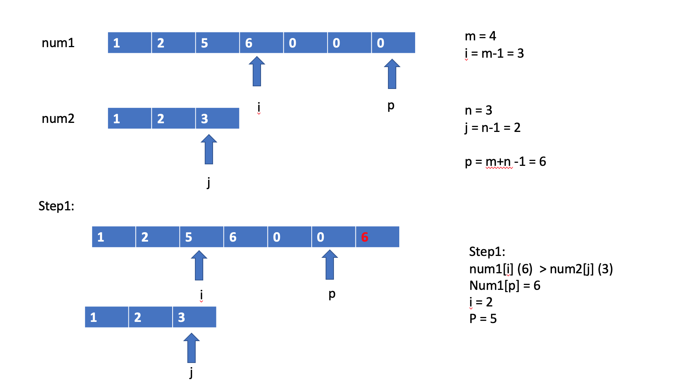
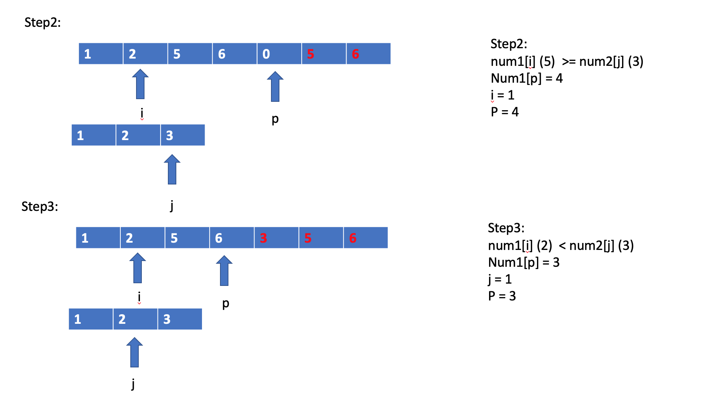
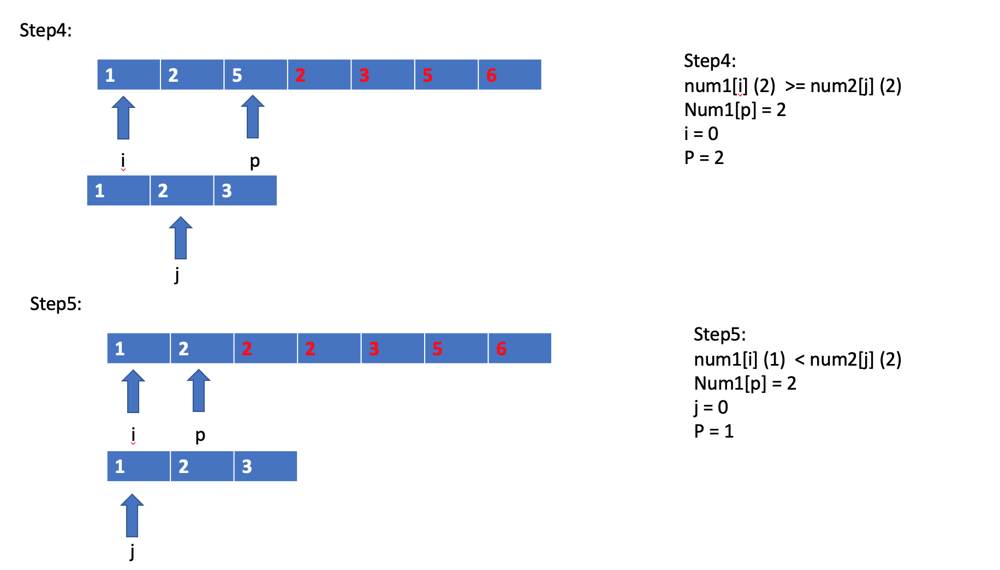
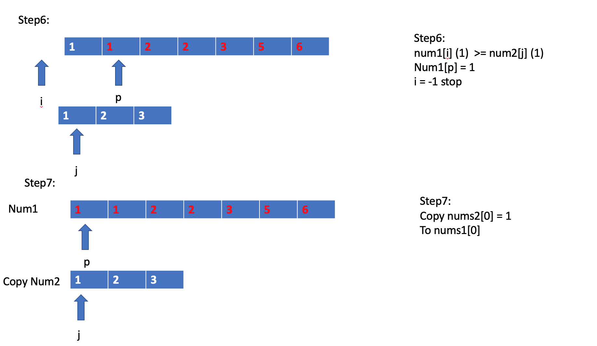

# Array

\*\*\*\*[**88. Merge Sorted Array**](https://leetcode-cn.com/problems/merge-sorted-array/)\*\*\*\*

* Usually, if sort two arrays, it is easier we use another array to store the sorted order. 
* This question needs to be solved in-place. 
* Traverse from front to end will easily replace the current number. So using a trick to traverse from the end to front \(starting from the last position where is the m+n-1 to store the number\)

```python
# Solution1: Brute force - just combine two arrays and sort them, and deep copy of nums1 as the new array
# TC: O((n+m)log(m+n)) = O(nlogn)  SC: O(n+m) = O(n) 
nums1[:] = sorted(nums1[:m] + nums2[:]) 

# Solution2: In place (See images below)
# TC: O(m+n) = O(n)  SC: O(1) - we do not create any new space
class Solution:
    def merge(self, nums1: List[int], m: int, nums2: List[int], n: int) -> None:
        """
        Do not return anything, modify nums1 in-place instead.
        """
        # i for last index of nums1 and j for last index of nums2
        i, j = m-1, n-1 
        # the last index of the merged array
        p = m+n-1 
        # termination case: i an j traverse from right to left
        while i >= 0 and j >= 0: 
            if nums1[i] >= nums2[j]: # compare i and j 
                nums1[p] = nums1[i]
                # already compared, move one step to left 
                i-=1 
            else:
                nums1[p] = nums2[j]
                # already compared, move one step to left
                j-=1 
        
            p-=1 #move the store place one to left 
        
        # if nums1 has element left, no need to care, since modify num1 inplace
        # if i >= 0: pass 
        # if nums2 has element left，copy the remaining elements to nums1 

        if j>=0:  # why j=0 still matter? for case nums1 = [] nums2 = [1]
            nums1[:j+1] = nums2[:j+1]
    
```










