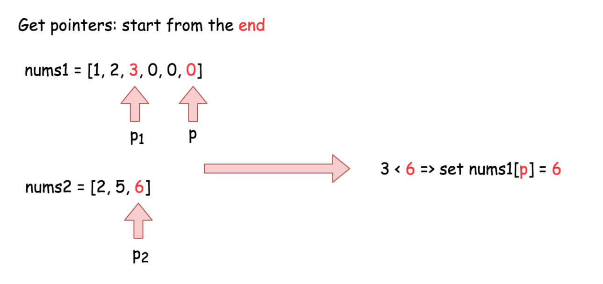

# Sorting Practice

1. Classical sorting 
2. Merge Sort 
3. Different sorting 

**Leetcode 88 Merge Sorted Array** 



```python
# Method 1: brute force 
# merge nums2 to nums1 in place 

# TC: O((m + n)log (m + n)) SC: O(m + n)
# m = len(nums1) n = len(nums2)
def merge(self, nums1: List[int], m: int, nums2: List[int], n: int) -> None
    nums1[:] = sorted(nums[:m] + nums2)
```

```python
# Method 2: extra space with merge sort 
# TC: O(m + n) SC: O(m)
def merge(self, nums1: List[int], m: int, nums2: List[int], n: int) -> None
    temp = nums1[:m] # copy nums1
    nums1[:] = []  # clear nums1
    i = j = 0 
    while i < m and j < n:
        if temp[i] < nums2[j]:
            nums1.append(temp[i])
            i+=1
        else:
            nums1.append(nums2[j])
            j+=1
    if i < m:
        nums1[i + j:] = temp[i:] # items after i+j 
    if j < n:
        nums1[i + j:] = nums2[j:]
```

```python
# Method 3: in-place 
# TC: O(m+n) SC: O(1)
def merge(self, nums1: List[int], m: int, nums2: List[int], n: int) -> None
    i, j = m-1, n-1
    p = m + n-1
    while i >= 0 and j >= 0:
        if nums1[i] > nums2[j]:
            nums1[p] = nums1[i]
            i-=1
        else:
            nums1[p] = nums2[j]
            j-=1
        p-=1
    # nums2 left elements
    nums1[:j+1] = nums2[:j+1] 
```



**Problem: Find smallest k items in an unsorted array**

Find smallest k elements from an unsorted array of size n. The output should be in ascending order.

```python
# Solution 1: Minheap
# heapify all elements  O(n)
# call pop() k times to get k smallest items (klogn)
# TC: O(n + klogn) SC: O(k)
import heapq
def kSmallest(array, k):
		if not array:
      return[]
    heapq.heapify(array)
    res = []
    for i in range(min(len(array), k)):
      	res.append(heapq.heappop(array))
    return res
```

```python
# Solution 2: Maxheap
# 1,5,3,4,6,2 k = 3    1 2 3    
#     -5      [4, 6, 2]    pop: -5, -4, -6     -3
#  -1   -3                                  -1    -2
# heapify the first k items in a maxheap with size = k  O(k)
# iterate the rest n-k items and update the top of the heap O((n-k)logk)
# item > top, ignore, else: add into the heap and update 
# TC: O(k + (n-k)logk) SC: O(k)
  
def Ksmallest(array, k):
  	if not array:
      return []     
    res = [-i for i in array[:k]] # maxheap 
    heapq.heapify(res) 
    for i in range(k, len(array)):
      	heapq.heappushpop(res, -array[i]) # pop k largest number
   	return sorted([-i for i in res]) # klogk  
```

