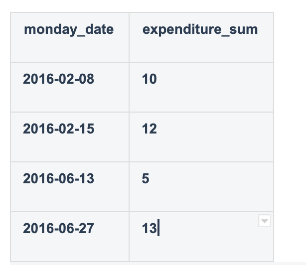
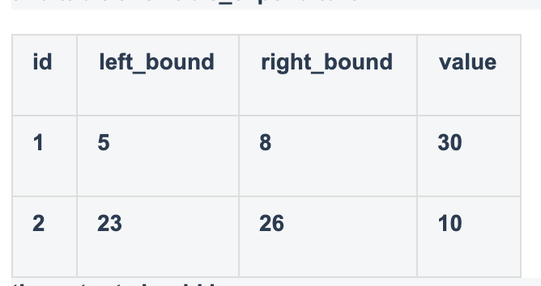
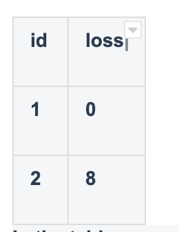

# Expenditure

**Your boss knows that you're a good programmer and that you're responsible, so she's given you a big task - to check the company's expenditure automatically. You're given the table expenditure\_plan, which describes all the planned expenditures, and the table allowable\_expenditure, which describes the amount that can be spent in certain time periods.**

**The expenditure\_plan table contains the following columns:**

* **monday\_date - the unique date of the Monday of the corresponding week;**
* **expenditure\_sum - the sum of the planned expenditure for the corresponding week. All dates in this table fall in the same year.**

**The allowable\_expenditure table contains the following columns:**

* **id - the unique ID of the limitation;**
* **left\_bound - the unique left bound of the time period, represented by the number of the week \(1-based\);**
* **right\_bound - the unique right bound of the time period, represented by the number of the week \(1-based\);**
* **value - the allowable sum that can be spent during the given left and right bounds, inclusive. The segments of the time periods don't intersect with one other. The weeks are numbered sequentially from the first week. Week 1 is the first full week of the year, meaning that its Monday is part of the current year.**

**Your task is to write a select statement which returns the columns id and loss, where the value of loss is either 0 \(if the expenditure limit with this id was not exceeded\) or the amount of money by which the planned expenditure exceeded the allowable expenditure, sorted by id.**

  








**In the table expenditure\_plan, the Mondays correspond to the weeks with numbers 6, 7, 24, and 26 respectively. For the first time period, we add up 10 and 12 to get 22. Since 22 is smaller than 30, the loss is 0. For the second time period, we add up 5 and 13 to get 18. Since 18 is greater than 10, the allowable expenditure for this time period, the answer is 18 - 10 = 8.**

```text
CREATE PROCEDURE checkExpenditure()
BEGIN
   SELECT id,
   CASE
   WHEN SUM(ep.expenditure_sum) - ae.value > 0
   THEN SUM(ep.expenditure_sum) - ae.value
   ELSE 0
   END
   AS loss
   FROM expenditure_plan as ep
   INNER JOIN allowable_expenditure as ae
   ON WEEK(ep.monday_date) BETWEEN ae.left_bound AND ae.right_bound
   GROUP BY ae.id;
END

```

