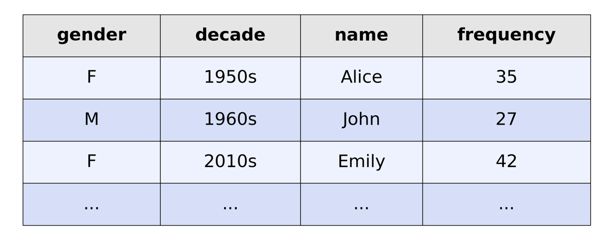
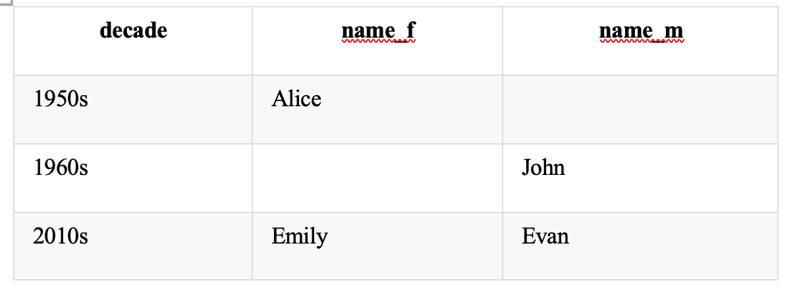

# Pivot Table

**PIVOT 1:** 

To help understand the data, you can interact with the following data table to peek at some rows of the table and sort the rows by a chosen column.

Your task is to complete the query, so that the query results will produce a table that contains one row for each decade with the most popular female name \(for gender "F"\) and male name \(for gender "M"\) during the decade in columns name\_f and name\_m, respectively. You can assume that the data table contains no ties for the most popular name for each gender and decade pair.





* For 1950s there is only one name in the given statistics, so it's the most popular - Alice. There were no statistics for males in this decade.
* For 1960s there are two male's statistics: the name John was given to 27 newborns and the name Dave to 25. So John was the most popular name in this decade. There were no statistics for females in this decade.
* For 2010s there are two female's statistics: the name Emily was given to 42 newborns and the name Sarah to 11. So Emily was the most popular name in this decade. There were no statistics for males in this decade.

```sql
SELECT decade, 
       MAX(CASE WHEN gender = 'F' THEN name ELSE '' END) as name_f, 
       MAX(CASE WHEN gender = 'M' THEN name ELSE '' END) as name_m
FROM 
(SELECT *, 
       ROW_NUMBER() OVER(PARTITION BY decade, gender ORDER BY frequency DESC) as rk 
FROM name_statistics ) T
WHERE T.rk = 1 
GROUP BY 1
ORDER BY 1
```


