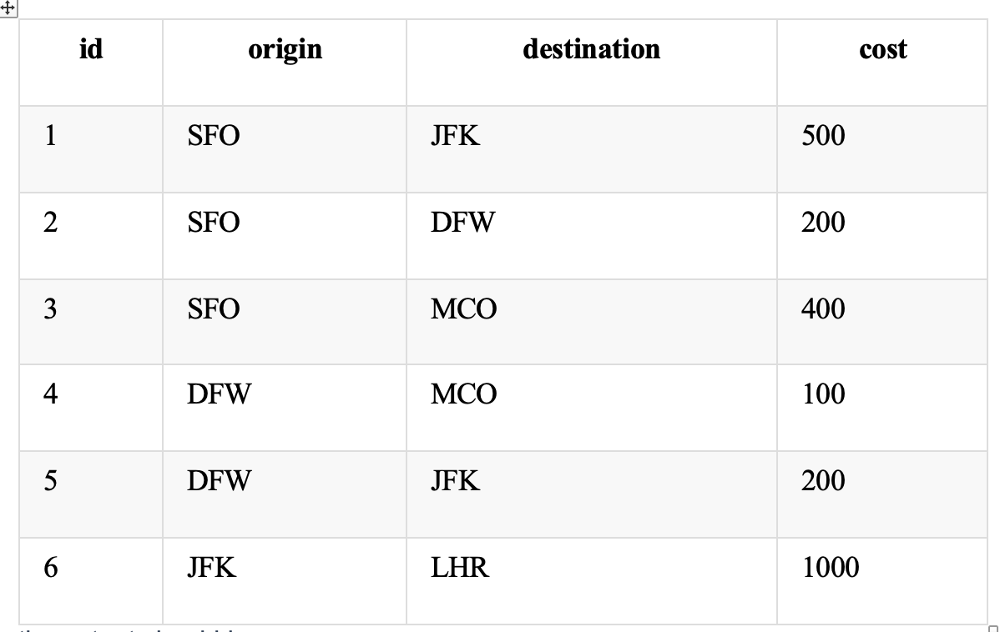

# Travel Problem

When people fly long distances, a direct city-to-city flight is often more expensive than taking two flights with a stop in a hub city. Travelers might save even more money by breaking the trip into three flights with two stops. But for the purposes of this challenge, let's assume that no one is willing to stop three times!

You have a table with individual airport-to-airport **flights**, which contains the following columns:

* id - the unique ID of the flight;
* origin - the origin city of the current flight;
* destination - the destination city of the current flight;
* cost - the cost of current flight.  The cities are all represented by an abbreviation composed of three uppercase English letters.

Your task is to write a select statement that lists all the cheapest possible trips that can be done in two or fewer stops. The output should have columns origin, destination, stops \(indicating the number of stops in current trip\), and total\_cost.



If two trips cost the same but have a different number of stops, include the one with the fewest stops. Sort the output table by origin, then by destination.

**Note**: A flight from SFO to JFK is considered to be different than a flight from JFK to SFO. For given table **flights：**




```sql
# step1: construct the table to get the flight stop information (join)
# step2: union the table and get row_number for ids 
# step3: rank the table by total cost 
# TBD

WITH t1 AS (
    SELECT *
    FROM flights a 
    LEFT JOIN flights b 
    ON b.origin = a.destination 
    LEFT JOIN flights c 
    ON c.origin = b.destination), 
    t2 AS (
    SELECT * 
    FROM t1 
    UNION 
    SELECT * 
    FROM flights )
    t3 AS (
    SELECT *, 
          SUM(cost) as total_cost
    FROM t2 
    GROUP BY origin, destination) 
    t4 AS(
    SELECT *, 
           ROW_NUMBER() OVER (PARTITION BY origin, destination ORDER BY total_cost DESC)
    FROM t3) 
    
END

```

